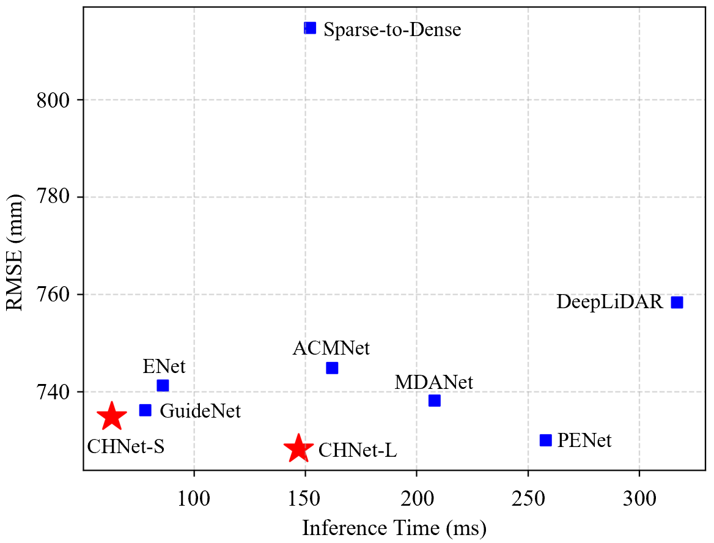

# A Concise but High-performing Network for Image Guided Depth Completion in Autonomous Driving
This repository is the implementation of our paper [A Concise but High-performing Network for Image Guided Depth Completion in Autonomous Driving](https://www.sciencedirect.com/science/article/pii/S0950705124005112).

## Demo
<p align="center">
  
</p>

## Results
<p align="center">
  
</p>

## Dependent Environment
You can refer to the following environment:
+ python=3.6.2
+ torch==1.9.0+cu111
+ torchvision==0.10.0+cu111
```bash
pip install numpy matplotlib Pillow
pip install scikit-image
pip install opencv-contrib-python
```

## Data
- Download the [KITTI Depth](http://www.cvlibs.net/datasets/kitti/eval_depth.php?benchmark=depth_completion) Dataset from their website. Use the following scripts to extract corresponding RGB images from the raw dataset. 
```bash
./download/rgb_train_downloader.sh
./download/rgb_val_downloader.sh
```
The downloaded rgb files will be stored in the `../data/data_rgb` folder. The overall code, data, and results directory is structured as follows.
```
├── CHNet
├── data
|   ├── data_depth_annotated
|   |   ├── train
|   |   ├── val
|   ├── data_depth_velodyne
|   |   ├── train
|   |   ├── val
|   ├── depth_selection
|   |   ├── test_depth_completion_anonymous
|   |   ├── test_depth_prediction_anonymous
|   |   ├── val_selection_cropped
|   └── data_rgb
|   |   ├── train
|   |   ├── val
├── results
```

## Train 
You can train the CHNet through the following command:
```
python main.py -b 8 (8 is a example of batch size)
```
## Evalution
You can evaluate the CHNet through the following command:
```
python main.py -b 1 --evaluate [checkpoint-path]
```
## Test
You can test the CHNet through the following command for online submission:
```
python main.py -b 1 --evaluate [checkpoint-path] --test
```

## Acknowledgement
Many thanks to these excellent opensource projects 
* [PENet](https://github.com/JUGGHM/PENet_ICRA2021)
* [GuideNet](https://github.com/kakaxi314/GuideNet)
* [self-supervised-depth-completion](https://github.com/fangchangma/self-supervised-depth-completion)

## Citation
Please consider citing my work as follows if it is helpful for you.
```
@article{liu2024concise,
  title={A concise but high-performing network for image guided depth completion in autonomous driving},
  author={Liu, Moyun and Chen, Bing and Chen, Youping and Xie, Jingming and Yao, Lei and Zhang, Yang and Zhou, Joey Tianyi},
  journal={Knowledge-Based Systems},
  pages={111877},
  year={2024},
  publisher={Elsevier}
}
```

